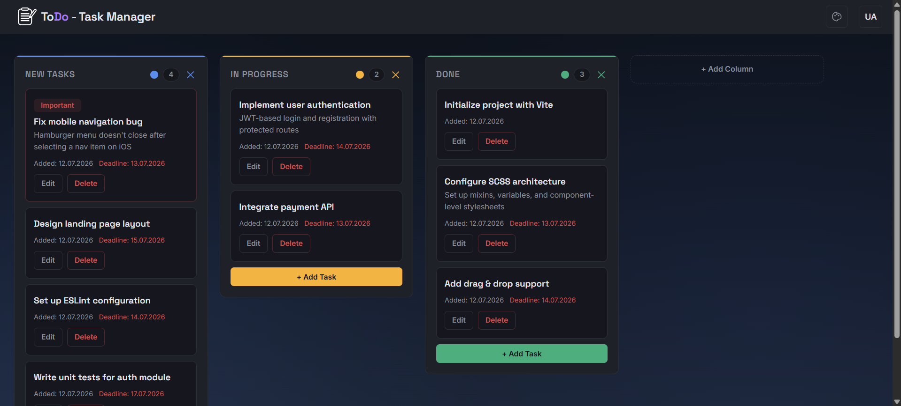

# ToDo List, Task Manager

A web application for managing tasks — rename, delete, drag & drop, and organize them across columns.



## Features
- Drag & drop tasks between columns
- UA / EN localization with persistent language selection
- 6 background theme presets
- Tasks with title, description, deadline, and priority mark
- Create, rename, and delete columns with custom colors
- Data persisted in localStorage

## Tech Stack
- **React 19** — UI library
- **Vite** — build tool
- **SCSS** — styling with mixins and CSS custom properties
- **Bootstrap 5** — base UI components
- **@dnd-kit** — drag & drop
- **i18next / react-i18next** — localization

##

## Getting Started
```bash
# Install dependencies
npm install

# Start the development server
npm run dev
```
## Live Demo
[todo-task-manager-three.vercel.app](https://to-do-task-manager-three.vercel.app/)

## License
MIT
